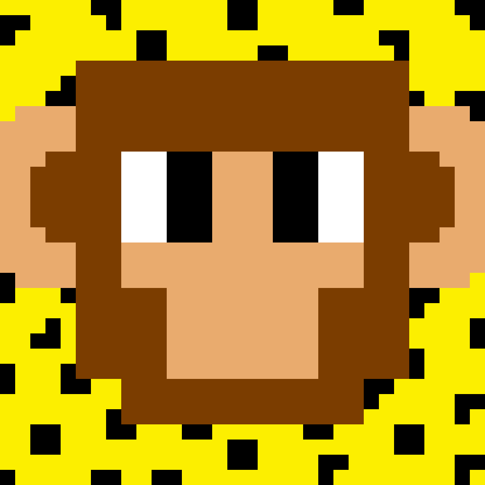
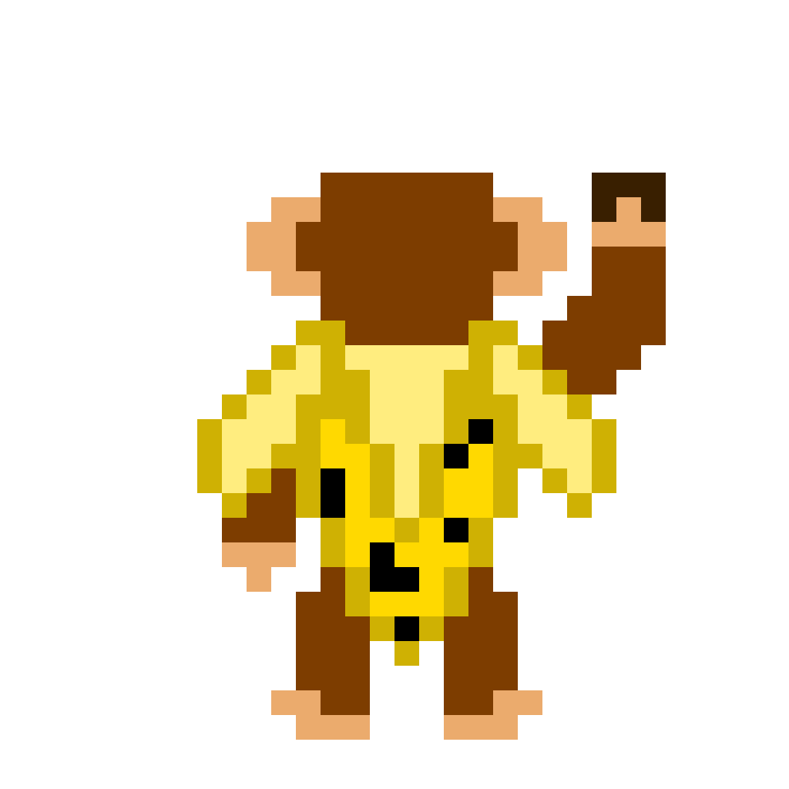
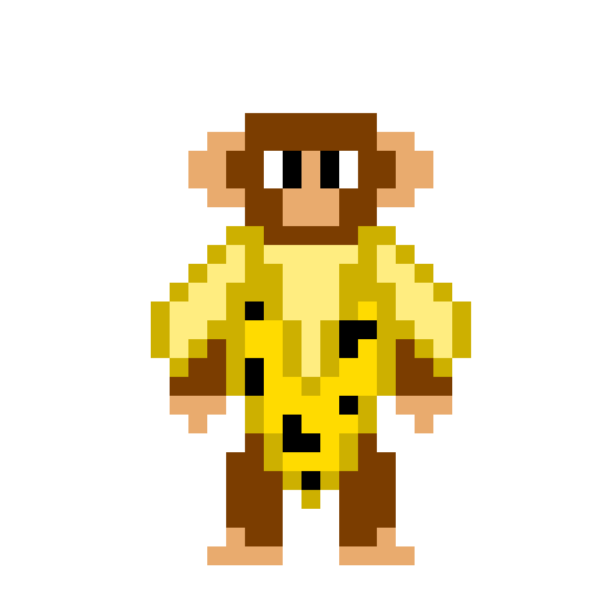
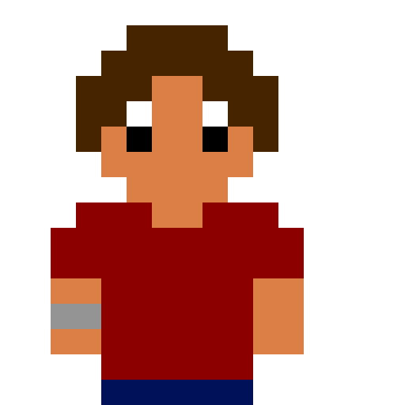
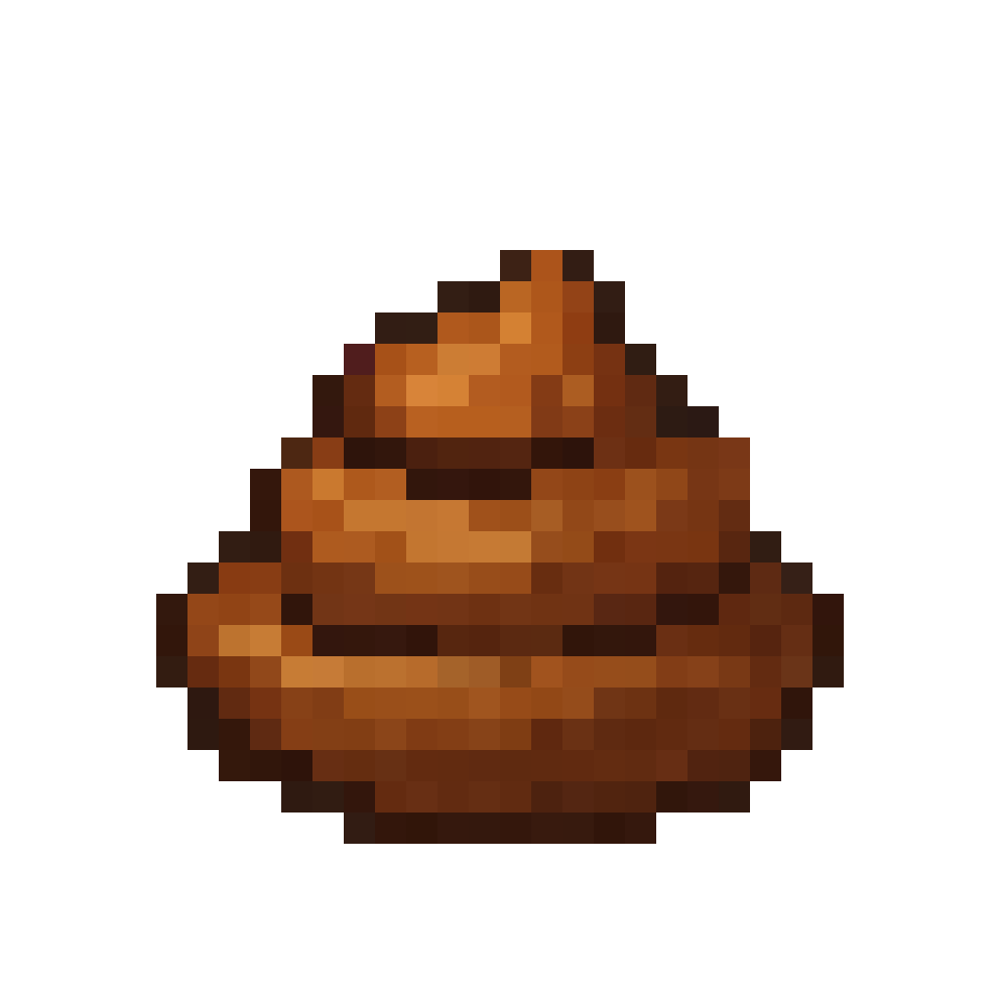
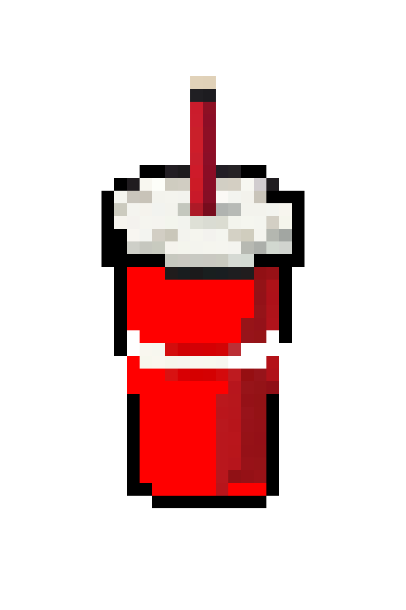
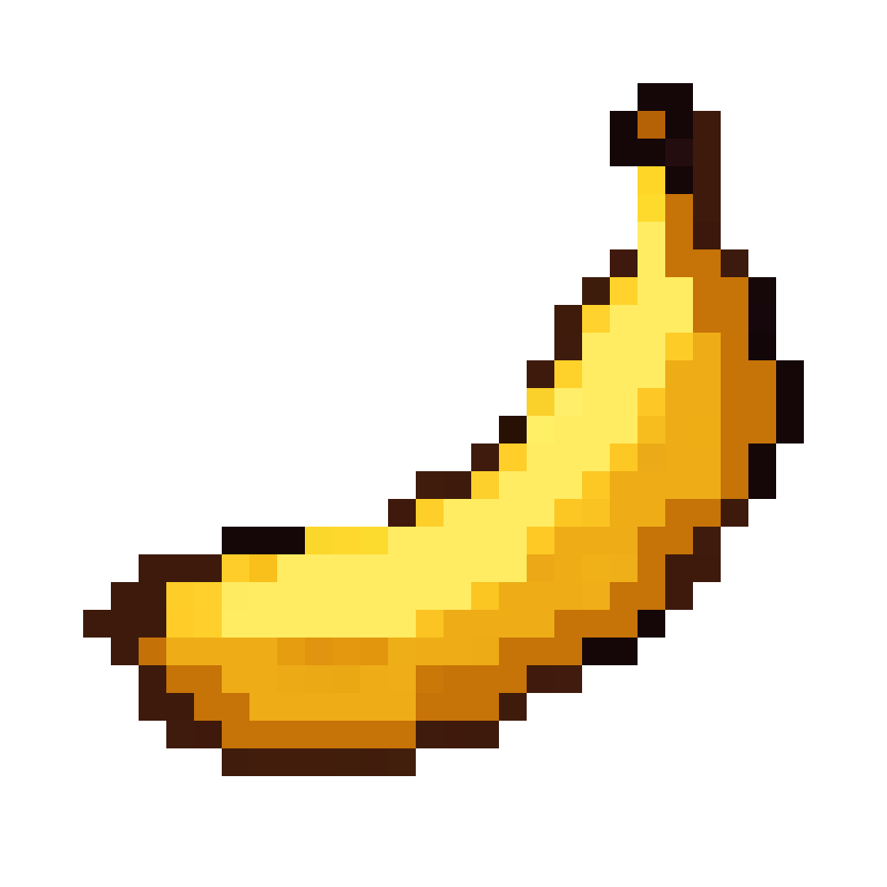
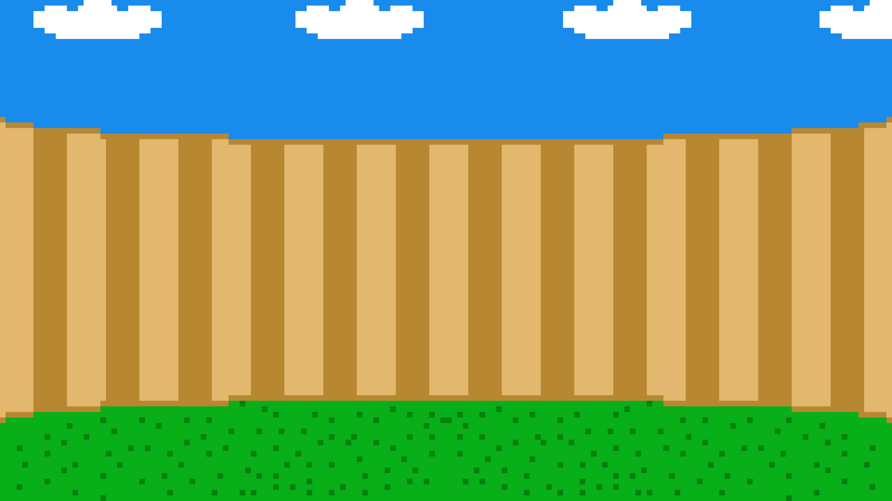
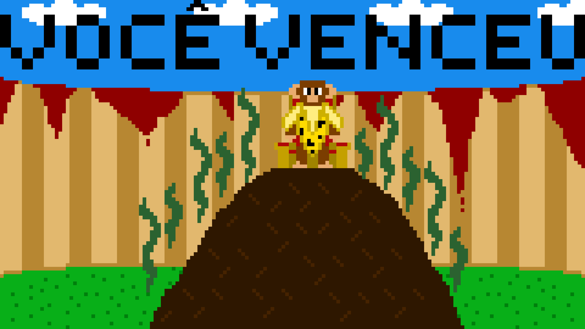
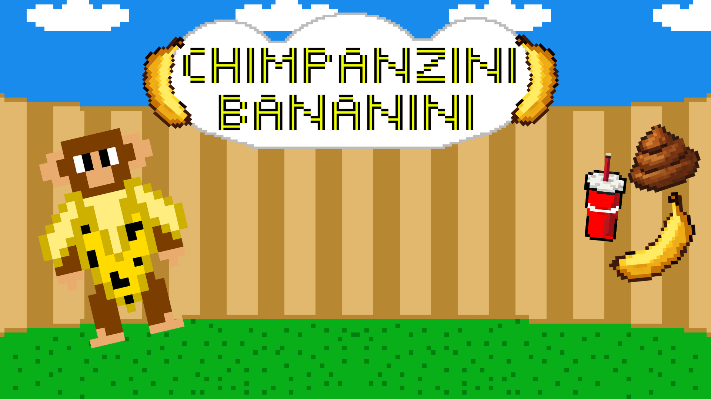

# Chimpanzini_Bananini
Chimpanzini Bananini é um jogo 2D para web que servira para avaliação do 4° bimestre da disciplina de DJW e de português 

## Descrição do Jogo
Chimpanzini Bananini é um jogo de ação no estilo arcade, onde o jogador controla um macaco que deve enfrentar inimigos lançando suas proprias fezes neles, enquanto desvia de ataques. O objetivo é eliminar todos os inimigos antes que o tempo acabe ou antes de perder todas as vidas.

## Como Jogar
- Use as teclas **A** e **D** para mover o macaco para a esquerda e direita.
- Evite os lixos disparados pelos inimigos, que diminuem suas vidas.
- Pegue as bananas disparadas pelos inimigos para recuperar uma vida.
- O jogo dura 2 minutos. Se o jogador sobreviver ou eliminar todos os inimigos, vence.
- Ao perder todas as vidas ou quando o tempo acabar, o jogo termina.

## Personagens e Elementos

### Macaco (Jogador)
  

O personagem controlado pelo jogador. Pode se mover horizontalmente e atirar projéteis.

### Inimigos
  
Os inimigos lançam dois tipos de projéteis:
- Lixo: causa dano ao jogador
- Banana: recupera vida do jogador

### Corações de Vida
  
Representam a vida do jogador. Cada lixo remove um coração; cada banana recupera um coração.

### Fezes
  
Disparados pelo jogador para eliminar inimigos.

  
Projéteis que causam dano.

  
Projéteis que recuperam vida.

## Fundo e Estética
  
O jogo possui um fundo animado em GIF para dar mais vida à tela.

### Botões
 

## Tela de Vitória e Game Over
- Vitória:  

- Game Over:  

- Tela do Menu:

## Tecnologias Utilizadas
- Linguagens de Programação: HTML, CSS, JavaScript  
- Editor de Código: Visual Studio Code  
- Gerenciamento de Versão: Git / GitHub  
- Software de Arte: Piskel  
